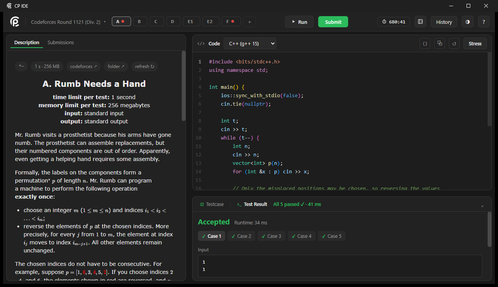
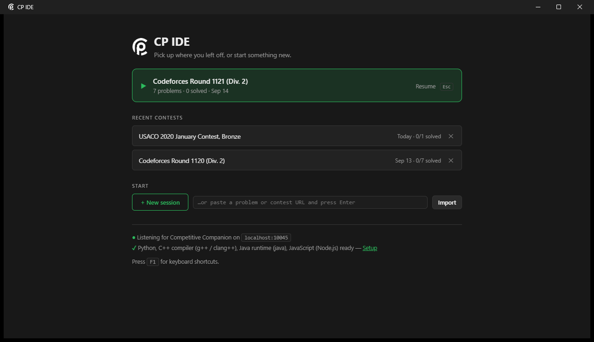

# CP IDE

## A free desktop IDE for competitive programming — import a problem, solve it, run every sample, submit to the judge, without leaving the window.

CP IDE is a C++ desktop app for people who do timed programming contests. A problem
arrives from the [Competitive Companion](https://github.com/jmerle/competitive-companion)
browser extension or a pasted URL, and the app does the boring part: it creates the
folders, writes the sample tests to disk, renders the statement next to your editor, and
gives you one key to compile and run everything. It covers:

* Importing a single problem or a whole contest from Codeforces, AtCoder, CSES, USACO and HackerRank
* Rendering the real statement — images, tables and LaTeX — beside the code, not in a browser tab
* Running every sample in Python, C++, Java or JavaScript with `PASS` / `WA` / `TLE` / `RE` per case
* Saying *why* a run failed — the exception, the first differing token, what the exit code means
* Submitting to Codeforces, AtCoder, CSES and USACO from inside the app, with the verdict polled back
* Stress testing against a brute force, and a real step debugger for Python and C++
* Keeping a per-problem timer, notes and a verdict history across every contest you have opened

Nothing is paywalled, there is no account, and your solutions are plain files in a folder
you can open with anything else.



<p align="center"><em>A Codeforces problem: statement on the left, editor on the right, all five samples green.</em></p>

## Install it

**Windows** — download `CP-IDE-Setup-0.1.0.exe` from the Releases page and run it. It is
about 8 MB, adds Start Menu and desktop shortcuts, and pulls the Microsoft Edge WebView2
runtime if the machine lacks it (Windows 11 already has it).

On first launch the app checks for Python, g++, Java and Node, and offers a one-click
install for whatever is missing. You do not need all four — only the languages you use.

Then:

1. Install [Competitive Companion](https://github.com/jmerle/competitive-companion) in your browser
2. Check that port **10045** is in its port list (it is, by default)
3. Open a problem or contest page and click the green **+**

It shows up as a tab, with its samples already in place. No Companion? Paste the URL into
the box on the home screen instead — a problem URL imports one problem, a contest URL
imports the whole round.



Press `F1` at any time for the keyboard shortcuts. The ones worth learning first are
`Ctrl+Enter` to run every sample and `Ctrl+Shift+Enter` to submit.

## Build it yourself

All dependencies are vendored in `third_party/` — webview, the WebView2 SDK, nlohmann/json,
Monaco and KaTeX — so the build needs no network access.

**Windows**, with the [MSYS2](https://www.msys2.org/) UCRT64 toolchain:

```powershell
pacman -S mingw-w64-ucrt-x86_64-gcc mingw-w64-ucrt-x86_64-cmake mingw-w64-ucrt-x86_64-ninja
$env:PATH = "C:\msys64\ucrt64\bin;$env:PATH"
cmake -B build -G Ninja -DCMAKE_BUILD_TYPE=Release
cmake --build build
.\build\bin\cp-ide.exe
```

**Linux:**

```sh
sudo apt install g++ cmake ninja-build libwebkit2gtk-4.1-dev   # Fedora: webkit2gtk4.1-devel
cmake -B build -G Ninja -DCMAKE_BUILD_TYPE=Release
cmake --build build && ./build/bin/cp-ide
```

**macOS:**

```sh
xcode-select --install && brew install cmake ninja
cmake -B build -G Ninja -DCMAKE_BUILD_TYPE=Release
cmake --build build                      # -> build/bin/cp-ide.app
```

### How it fits together

```
src/            C++ core: window, RPC bridge, HTTP server, storage, runner, judges, stress, debugger
src/judges/     one driver per site; adding a judge means adding a SiteDriver, not a new app
ui/             the front end (index.html, style.css, app.js), served from 127.0.0.1:10045
tools/          cp_debug.py (Python debugger helper), make_icon.py (rebuilds the app icon)
third_party/    vendored dependencies
```

The core is C++ and owns everything that touches disk, processes and judges. The UI is a
web front end in a native window, talking to the core over a local RPC bridge. If you want
to change how something *looks*, you want `ui/`. How it *behaves*, `src/`.

Your data lives in `%USERPROFILE%\cp` (`~/cp` elsewhere; override with `CP_IDE_HOME`):

```
cp/contests/<contest>/<problem>/
    main.cpp  main.py  Main.java  main.js   your solutions
    gen.py    brute.py                      stress-test generator and reference
    tests/1.in 1.out ...                    samples, plus any case you add
    problem.json                            title, URL, limits, fetched statement
```

Plain files, plain JSON. Delete a folder and that problem is gone; there is no database.

## Found a bug?

Please open an issue using the Issues tab above. The useful ones say which judge and
problem URL it happened on, since most rough edges are one site's markup rather than the
app itself.

Pull requests are welcome. Two things make them easy to merge:

* **One change per PR.** A statement-parser fix and a UI tweak are two pull requests.
* **Say how you checked it.** Not a test suite — just the problem URL you tried it on and what you saw.

If you are adding a judge, `src/judges/drivers.cpp` is the place; each site is one
`SiteDriver` describing its login check, submit form and verdict page.

## Known issues

* **Linux and macOS get far less testing than Windows.** They build from the same sources and work, but Windows is what gets used daily. Reports from the other two are especially welcome.
* **The C++ debugger needs gdb**, which macOS does not ship. The Python debugger works everywhere.
* **USACO verdict parsing is best effort**, and USACO shows no submit form at all once a contest closes — the app now tells you which of those happened rather than failing silently.
* **HackerRank has no in-app submit.** Submit copies your code and opens the problem page.
* **Codeforces sits behind an anti-bot check.** Statement fetching falls back to the `curl.exe` that ships with Windows, which gets through. The browser fallback always works if auto-submit is blocked.

## Like this project?

It is MIT licensed and free, and it will stay that way. If it saved you time in a contest,
starring the repo is genuinely the most useful thing you can do — it is how other people
doing contests find it.

Better still, open an issue when something annoys you. Most of what this app does well
started as somebody saying "why does it do *that*".

## License

MIT — see [`LICENSE`](LICENSE). Monaco, webview, KaTeX and nlohmann/json keep their own
licenses in `third_party/`.
