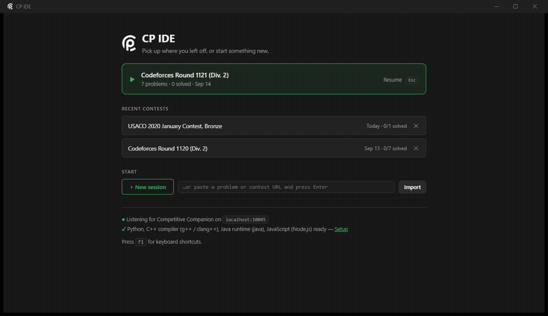

<div align="center">


# CP IDE

**Import a problem, solve it, run every sample, and submit to the judge without leaving the window.**

[](https://github.com/j-o-s-e-p-h-h/CP-IDE/releases/latest)
[](https://github.com/j-o-s-e-p-h-h/CP-IDE/releases)


[Install](#install-it) · [Build](#build-it-yourself) · [Report a bug](#found-a-bug) · [Known issues](#known-issues) · [License](#license)

</div>



<p align="center"><em>Resume a contest, write the solution, press <code>Ctrl+Enter</code> to run every sample and <code>Ctrl+Shift+Enter</code> to submit. The Codeforces verdict comes back in the same window; the recording is a real submission.</em></p>

CP IDE is a C++ desktop app for people who do timed programming contests and are mabye annoyed and tired of the hassle of copying and pasting from ide to browser. A problem
arrives from the [Competitive Companion](https://github.com/jmerle/competitive-companion)
browser extension or a pasted URL, and the app creates the folders, writes the sample
tests to disk, renders the statement next to your editor, and gives you one key to compile
and run everything. It covers:

* Importing a single problem or a whole contest from Codeforces, AtCoder, CodeChef, CSES, USACO and HackerRank
* Rendering the real statement (images, tables and LaTeX) beside the code instead of in a browser tab
* Running every sample in Python, C++, Java or JavaScript with `PASS` / `WA` / `TLE` / `RE` per case
* Saying *why* a run failed: the exception, the first differing token, or what the exit code means
* Submitting to Codeforces, AtCoder, CSES and USACO from inside the app, with the verdict polled back
* Stress testing against a brute force, and a real step debugger for Python and C++
* Keeping a per-problem timer, notes and a verdict history across every contest you have opened


<p align="center"><em>The statement keeps its own images, tables and LaTeX; the test panel names the case that failed and why.</em></p>

## Install it

Every platform has a download on the
[latest release](https://github.com/j-o-s-e-p-h-h/CP-IDE/releases/latest).
To compile it instead, [build it yourself](#build-it-yourself) in three commands.

| Platform | Download | Notes |
| --- | --- | --- |
| Windows | `CP-IDE-Setup-0.1.0.exe` | 4.1 MB. Start Menu and desktop shortcuts; pulls the Edge WebView2 runtime if the machine lacks it (Windows 11 already has it). SmartScreen will warn; see below. |
| Linux | `cp-ide_0.1.0_amd64.deb` | `sudo apt install ./cp-ide_0.1.0_amd64.deb`. A `.tar.gz` is there too if you are not on Debian or Ubuntu. |
| macOS | `cp-ide-0.1.0-Darwin.dmg` | Apple Silicon. Unsigned, so the first launch needs a right-click and **Open**. |

### "Windows protected your PC"

This is expected. Click **More info**, then **Run anyway**.

On first launch the app checks for Python, g++, Java and Node, and offers a one-click
install for whatever is missing. You only need the languages you actually use.

Then:

1. Install Competitive Companion, from [Chrome](https://chromewebstore.google.com/detail/competitive-companion/cjnmckjndlpiamhfimnnjmnckgghkjbl) or [Firefox](https://addons.mozilla.org/en-US/firefox/addon/competitive-companion/). On Edge, Brave, Opera, Vivaldi or any other Chromium browser, install the Chrome one. Edge will ask you to allow extensions from other stores first.
2. Check that port 10045 is in its port list (it is, by default)
3. Open a problem or contest page and click the green **+**

It shows up as a tab with its samples already in place. Without Companion, paste the URL
into the box on the home screen: a problem URL imports one problem, a contest URL imports
the whole round.

Which browser you use only matters for the extension. The judge login windows are the
app's own (WebView2 on Windows, WebKitGTK on Linux, WKWebView on macOS), so signing in to
Codeforces inside CP IDE is separate from your browser session, and it persists.


Press `F1` at any time for the keyboard shortcuts. The ones worth learning first are
`Ctrl+Enter` to run every sample and `Ctrl+Shift+Enter` to submit.

## Build it yourself

All dependencies are vendored in `third_party/` (webview, the WebView2 SDK, nlohmann/json,
Monaco and KaTeX), so the build needs no network access.

```sh
git clone https://github.com/j-o-s-e-p-h-h/CP-IDE.git cp-ide
cd cp-ide
```

On Windows, with the [MSYS2](https://www.msys2.org/) UCRT64 toolchain:

```powershell
pacman -S mingw-w64-ucrt-x86_64-gcc mingw-w64-ucrt-x86_64-cmake mingw-w64-ucrt-x86_64-ninja
$env:PATH = "C:\msys64\ucrt64\bin;$env:PATH"
cmake -B build -G Ninja -DCMAKE_BUILD_TYPE=Release
cmake --build build
.\build\bin\cp-ide.exe
```

On Linux:

```sh
sudo apt install g++ cmake ninja-build libwebkit2gtk-4.1-dev   # Fedora: webkit2gtk4.1-devel
cmake -B build -G Ninja -DCMAKE_BUILD_TYPE=Release
cmake --build build && ./build/bin/cp-ide
sudo cmake --install build               # optional: puts it on PATH with a menu entry
```

On macOS:

```sh
xcode-select --install && brew install cmake ninja
cmake -B build -G Ninja -DCMAKE_BUILD_TYPE=Release
cmake --build build                      # -> build/bin/cp-ide.app
```

The macOS bundle is neither signed nor notarized, so Gatekeeper refuses to open it on first
launch. Right-click the app and pick **Open** to run it anyway. The same applies to the
`.dmg` on the releases page.

`cpack` from the build directory produces the installer for the platform you are on: a
`.deb` and a `.tar.gz` on Linux, a `.dmg` on macOS. On Windows use
`cmake --build build --target installer`, which needs
[Inno Setup 6](https://jrsoftware.org/isinfo.php). Pushing a `v*` tag makes CI build and
publish all three.

### How it fits together

```
src/            C++ core: window, RPC bridge, HTTP server, storage, runner, judges, stress, debugger
src/judges/     one driver per site; adding a judge means adding a SiteDriver, not a new app
ui/             the front end (index.html, style.css, app.js), served from 127.0.0.1:10045
tools/          cp_debug.py (Python debugger helper), make_icon.py (rebuilds the app icon)
third_party/    vendored dependencies
```

The core is C++ and owns everything that touches disk, processes and judges. The UI is a
web front end in a native window, talking to the core over a local RPC bridge. Change how
something *looks* in `ui/`, how it *behaves* in `src/`.

Your data lives in `%USERPROFILE%\cp` (`~/cp` elsewhere; override with `CP_IDE_HOME`):

```
cp/contests/<contest>/<problem>/
    main.cpp  main.py  Main.java  main.js   your solutions
    gen.py    brute.py                      stress-test generator and reference
    tests/1.in 1.out ...                    samples, plus any case you add
    problem.json                            title, URL, limits, fetched statement
```

Everything is plain files and plain JSON. Delete a folder and that problem is gone; there
is no database.

## Found a bug?

Please open an issue on the
[issue tracker](https://github.com/j-o-s-e-p-h-h/CP-IDE/issues). The useful ones say which
judge and problem URL it happened on, since most rough edges come from one site's markup
rather than the app itself.

Pull requests are welcome. Two things make them easy to merge. Keep one change per pull
request, so that a statement-parser fix and a UI tweak arrive separately. And say how you
checked it: there is no test suite to run, so the problem URL you tried and what you saw
is enough.

If you are adding a judge, `src/judges/drivers.cpp` is the place; each site is one
`SiteDriver` describing its login check, submit form and verdict page.

## Known issues

* Nothing is code-signed. Windows SmartScreen says "Windows protected your PC" and shows the publisher as Unknown; macOS Gatekeeper refuses the first launch. Both are one extra click. Certificates cost a few hundred dollars a year each, and a plain Windows one still warns until the file builds download reputation.
* The macOS build is Apple Silicon only. An Intel build would need a second CI job.
* Linux and macOS get far less testing than Windows. They are built and packaged on every release, but Windows is what gets used daily. Reports from the other two are especially welcome.
* The C++ debugger needs gdb, which macOS does not ship. The Python debugger works everywhere.
* USACO verdict parsing is best effort, and USACO shows no submit form at all once a contest closes. The app says which of those happened rather than failing silently.
* CodeChef and HackerRank import but do not auto-submit. Statements, limits and samples come in fine; Submit copies your code to the clipboard and opens the site's submit page, because both render their submit forms in JavaScript that changes too often to pin down.
* Codeforces sits behind an anti-bot check. Statement fetching falls back to the `curl.exe` that ships with Windows, which gets through. The browser fallback always works if auto-submit is blocked.

## Like this project?

It is MIT licensed and free, and it will stay that way. If it saved you time in a contest,
starring the repo helps more than anything else, since that is how other people doing
contests find it ;)).


## License

MIT; see [`LICENSE`](LICENSE). Monaco, webview, KaTeX and nlohmann/json keep their own
licenses in `third_party/`.
